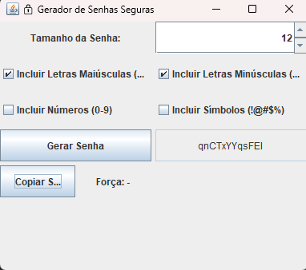

⚙️ Funcionalidades

✅ Escolher o tamanho da senha
✅ Selecionar o que incluir (maiúsculas, minúsculas, números, símbolos)
✅ Exibir a senha gerada
✅ Mostrar nível de força da senha
✅ Copiar senha com um clique

//----//

🚀 Como Executar

Salve o arquivo como SecurePasswordGenerator.java

Compile:

javac SecurePasswordGenerator.java

Execute:

java SecurePasswordGenerator

A janela do gerador vai abrir automaticamente 🎉

